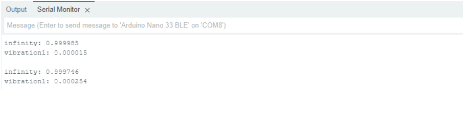
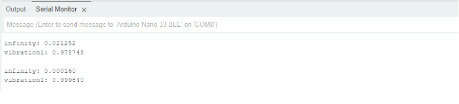

# Classification de Deux Types de Vibrations avec Machine Learning

## 1. Introduction

Ce projet vise à créer un modèle de Machine Learning permettant de classifier **deux types de vibrations** à partir des données d'un capteur IMU (accéléromètre et gyroscope) intégré sur une carte **Arduino Nano 33 BLE Sense**. 

Le but est d'entraîner un modèle **TinyML** qui pourra reconnaître les vibrations en temps réel directement sur la carte Arduino.

## 2. Reproduction de l'Expérience

### 2.1. Types de Vibrations 
Deux vibrations ont été enregistrées :
- **Infinity** : Générée par une application de smartphone.
- **Vibration1** : Générée par un appareil Moulinex (puissance 1).

L'application de smartphone permet de facilement reproduire la vibration, mais elle manque de puissance, ce qui oblige à réduire le seuil de détection dans le code Arduino. Cependant, cela peut rendre le modèle trop sensible et provoquer des faux positifs.

En comparaison, la vibration d'un Moulinex est plus puissante et plus distincte, facilitant la classification.

La carte doit également etre bien coller aux differents objets qui produise les vibrations.

L'application utilisée pour générer la vibration **Infinity** est la suivante :

## 3. Matériel et Logiciels Utilisés

### 3.1. Matériel
- **Arduino Nano 33 BLE Sense** (avec IMU intégré)
- **Câble USB** pour la connexion au PC
- **Support de fixation** (optionnel, pour stabiliser l'IMU)

### 3.2. Logiciels et Bibliothèques
- **Arduino IDE** (avec la bibliothèque `Arduino_LSM9DS1` pour lire l'IMU)
- **Python 3.x** (avec `pyserial`, `numpy`, `pandas`, `matplotlib`)
- **Google Colab** (utilisé pour entraîner le modèle avec TensorFlow Lite, plus rapide que Jupyter Notebook)

## 4. Collecte des Données

Les données des vibrations sont collectées via l'IMU de la carte Arduino.
Nous enregistrons les valeurs suivantes :
- **Accélération** : `aX`, `aY`, `aZ` (en G)
- **Gyroscope** : `gX`, `gY`, `gZ` (en degrés/seconde)

Le projet contient **deux fichiers de données** :
- `infinity.csv` : Vibration générée par l'application de smartphone.
- `vibration1.csv` : Vibration produite par un Moulinex.

Un programme Arduino envoie ces données via le port série. Un script Python (`serial_to_csv.py`) les enregistre sous format `.csv`.

## 5. Entraînement du Modèle de Machine Learning

L'entraînement est réalisé sur **Google Colab** avec **TensorFlow Lite**.

### 5.1. Prétraitement des Données
- Normalisation des valeurs de l'IMU.
- Division des données en **train (80%)** et **test (20%)**.

### 5.2. Architecture du Modèle
- Type : **Réseau de Neurones Profonds (MLP)**
- Entrée : 6 paramètres (aX, aY, aZ, gX, gY, gZ)
- Couches cachées : 2 couches denses (activation ReLU)
- Sortie : 2 classes (une par vibration) avec une activation `softmax`

### 5.3. Compilation et Entraînement
- **Fonction de perte** : Categorical Crossentropy
- **Optimiseur** : Adam
- **Nombre d'époques** : 300

## 6. Déploiement et Inférence sur Arduino

Après l'entraînement, le modèle est converti en **TensorFlow Lite pour Microcontrollers (TFLM)** et intégré à un code Arduino.

Le modèle est exécuté en temps réel sur la carte pour classifier les vibrations captées.

## 7. Résultats et Améliorations

### 7.1. Résultats
Teste de la vibration infinity:

Teste de la vibration du moulinex:

Le modèle parvient à distinguer les deux vibrations. Cependant, il est très sensible aux petites variations. Avant de tester une nouvelle vibration, il est préférable de laisser la carte stable pendant quelques secondes jusqu'à ce que plus rien ne s'affiche dans le moniteur série d'Arduino.

### 7.2. Améliorations Possibles
- Utiliser un réseau de neurones convolutionnel 1D (CNN 1D) : offre de meilleurs résultats mais peut poser des problèmes de dimensionnement des données. TensorFlow ajoute une option `Expand_DIM` qui n'est pas supportée sur l'Arduino Nano BLE.
- Utiliser des vibrations plus facilement contrôlables pour garantir la reproductibilité du projet.

## 8. Conclusion

Ce projet démontre l'utilisation de TinyML pour classifier des vibrations en temps réel sur un microcontrôleur embarqué.

## 9. Ressources et Références
- [TensorFlow Lite for Microcontrollers](https://www.tensorflow.org/lite/microcontrollers)
- [Arduino Nano 33 BLE Sense](https://store.arduino.cc/products/arduino-nano-33-ble-sense)
