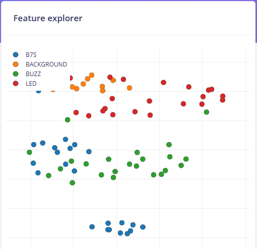
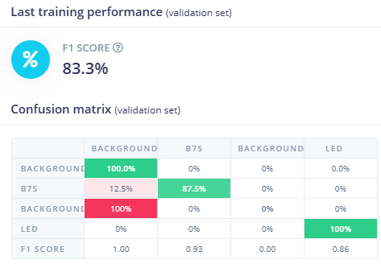

### Projet de Classification avec Edge Impulse et Arduino Nano 33 BLE Sense

Ce projet a pour objectif de mettre en place un système de reconnaissance basé sur l'intelligence artificielle embarquée. Grâce à **Edge Impulse**, la carte **Arduino Nano 33 BLE Sense** est utilisée pour capturer et traiter des données en temps réel. L'objectif est de permettre l'acquisition, l'entraînement et l'inférence directement sur l'appareil, ouvrant ainsi la voie à des applications autonomes de classification et de détection.

### Connexion de la Carte Arduino Nano 33 BLE Sense à Edge Impulse

#### 1. Installation des Prérequis
- Télécharger et installer **[Arduino IDE](https://www.arduino.cc/en/software)**.
- Ajouter le **Board Manager Arduino Nano 33 BLE** dans Arduino IDE.
- Installer **Edge Impulse CLI** en exécutant la commande suivante :
  ```sh
  npm install -g edge-impulse-cli
  ```
- Vérifier que **Python 3.x** et **Node.js** sont bien installés pour exécuter les scripts nécessaires.

#### 2. Connexion de la Carte
- Brancher la **carte Arduino Nano 33 BLE Sense** via un câble USB.
- Vérifier que la carte est reconnue en lançant la commande suivante :
  ```sh
  edge-impulse-daemon
  ```
- Sélectionner le port série correspondant à la carte et établir la connexion avec Edge Impulse Studio.

## 3. Acquisition des Images
Les images des composants electroniques sont capturees directement a l'aide d Edge Impulse via l'interface de capture d'image.
Pour ce faire on procède comme suit:
2 Connexion de la camera OV7675 a l Arduino Nano 33 BLE Sense
3 Prise de photos en direct dans l onglet Data acquisition en cliquant sur start sampling

## 4. Etiquetage des Donnees
1 Acces a Labeling queue dans Edge Impulse
2 Attribution d un label a chaque image selon le type de composant
3 Verification et correction des labels pour garantir une classification optimale

## 5. Conception du Modele de Machine Learning
Un modele de reconnaissance d images est concu dans l onglet Impulse Design
Pour construire le modele on procede comme suit

1 Ajout d un bloc de traitement d images  ce projet a ete realise avec image
2 Selection d un modele de type Transfer Learning pour l entrainement Ici Objet detection
3 Enregistrement et validation de l architecture du modele

Deux sous onglets vont apparaitre qui permettent de voir l effet de l extraction des features par ces algorithmes
Sous l'onglet "image" et l'onglet "Objet Detection"

**i. Onglet Imange**

Le Feature Explorer montre une separation correcte entre les classes mais indique un chevauchement entre BACKGROUND et LED source potentielle d erreurs de classification Tandis que la classe B7S est bien regroupee les similarites entre les donnees de BACKGROUND et LED compliquent la distinction entre ces categories Pour ameliorer la classification il est recommande de multiplier les echantillons distincts de reduire les variations au sein des classes et d optimiser l extraction des caracteristiques Une autre solution serait d explorer une nouvelle methode de reduction de dimensionalite ou de recourir a un modele plus avance tel qu un CNN 1D afin de mieux separer les classes

**ii. Onglet Objet Detection**

Le modele avec un F1 Score de 833 montre de bonnes performances globales bien qu il souffre d une confusion notable entre B7S et BACKGROUND 125 Ce probleme est exacerbe par la presence de deux labels BACKGROUND dont l un ajoute manuellement et l autre genere automatiquement par Edge Impulse entrainant une mauvaise classification a 100 pour le second BACKGROUND Pour resoudre cela il est necessaire de supprimer le BACKGROUND en double d augmenter le nombre d echantillons de B7S afin de distinguer cette classe de BACKGROUND et de reequilibrer les classes pour minimiser les biais Si les erreurs persistent l utilisation d un modele plus avance tel qu un CNN 1D pourrait renforcer la robustesse de la classification

## 6. Entrainement et Optimisation du Modele
Une fois le modele configure l'entrainement est lance dans Model training


**Configuration**
Nombre d'epoques 100
Taux d apprentissage 0.001
Taille du batch 16
Ensuite on lance l'execution de l'entrainement et analyse des performances

Precision du modele doit etre superieure a 85

Confusion matrix pour verifier les erreurs de classification

## 7. Deployment et Integration sur Arduino

Le modele final est exporté et integré dans un programme Arduino
Dans l'onglet "Deployment" de edge-impulse on peut généré un fichier .zip pour arduino.
Ensuite, on peut:
2 Importer le fichier zip dans Arduino IDE
3 Implementation du modele dans un sketch Arduino

## 8. Lecture des images de la camera

Execution de l'inference pour classifier le composant
Transmission des resultats via Bluetooth

## 9. Affichage des Resultats sur Node RED
Les donnees de classification sont envoyees a un dashboard Node RED en temps reel.
Pour lancer NodeRED, on télécharge nodeRED sur la machine et
1 Connexion de l Arduino a Node RED via Bluetooth
2 Creation d un flux Node RED pour recevoir et afficher les donnees
3 Ajout de widgets pour visualiser le comptage des composants

## Resultats et Ameliorations
Le systeme est capable de distinguer et compter les composants electroniques avec une precision d environ 78.75% Cependant des ameliorations sont possibles
-Augmentation du dataset pour reduire les erreurs de classification
-La caméra connecté n'a pas une très bonne résolution.
-Le modèle doit etre très léger pour pouvoir etre embarqué sur le micontroleur ce qui reduit la précision.

##  Conclusion
Le projet met en oeuvre Edge Impulse et Arduino pour realiser un systeme intelligent de reconnaissance et de comptage de composants electroniques. 

