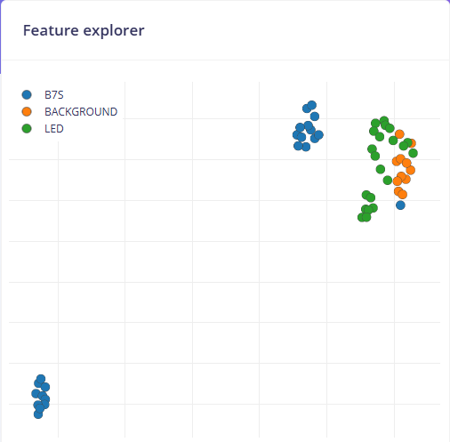

### Projet de Classification avec Edge Impulse et Arduino Nano 33 BLE Sense

Ce projet a pour objectif de mettre en place un système de reconnaissance et de classification basé sur l'intelligence artificielle embarquée. Grâce à **Edge Impulse**, la carte **Arduino Nano 33 BLE Sense** est utilisée pour capturer et traiter des données en temps réel. L'objectif est de permettre l'acquisition, l'entraînement et l'inférence directement sur l'appareil.

### Connexion de la Carte Arduino Nano 33 BLE Sense à Edge Impulse
#### 1. Installation des Prérequis
- Télécharger et installer **[Arduino IDE](https://www.arduino.cc/en/software)**.
- Ajouter le **Board Manager Arduino Nano 33 BLE** dans Arduino IDE.
- Installer **Edge Impulse CLI** en exécutant la commande suivante :
  ```sh
  npm install -g edge-impulse-cli
  ```
- Vérifier que **Python 3.x** et **Node.js** sont bien installés pour exécuter les scripts nécessaires.

#### 2. Connexion de la Carte
- Brancher la **carte Arduino Nano 33 BLE Sense** via un câble USB.
- Vérifier que la carte est reconnue en lançant la commande suivante :
  ```sh
  edge-impulse-daemon
  ```
- Sélectionner le port série correspondant à la carte et établir la connexion avec Edge Impulse Studio.

## 3. Acquisition des Images
Les images des composants electroniques sont capturées directement a l'aide d Edge Impulse via l'interface de capture d'image.
Pour ce faire on procède comme suit:
2 Connexion de la camera OV7675 a l Arduino Nano 33 BLE Sense
3 Prise de photos en direct dans l onglet Data acquisition en cliquant sur start sampling

## 4. Etiquetage des Donnees
1 Acces a "Labeling queue" dans Edge Impulse
2 Attribution d'un label à chaque image selon le type de composant

## 5. Conception du Modele de Machine Learning
Un modele de reconnaissance d images est concu dans l onglet Impulse Design
Pour construire le modele on procede comme suit

1 Ajout d un bloc de traitement d images  ce projet a ete realise avec image
2 Selection d un modele de type Transfer Learning pour l entrainement Ici Objet detection
3 Enregistrement et validation de l architecture du modele

Deux sous onglets vont apparaitre qui permettent de voir l effet de l extraction des features par ces algorithmes
Sous l'onglet "image" et l'onglet "Objet Detection"

**i. Onglet Image**




Le Feature Explorer montre une separation correcte entre les classes mais indique un chevauchement entre BACKGROUND et LED source potentielle d'érreurs de classification. Tandis que la classe B7S est bien regroupée.
Les similarités entre les donnees de BACKGROUND et LED compliquent la distinction entre ces categories. Cela doit etre du à la taille de la led qui est relativement petite et la caméra également qui n'a pas une bonne résolution rendant la distinction difficile pour le modèle.

**ii. Onglet Objet Detection**


Le modele avec un F1 Score de 83.3% montre de bonnes performances globales bien qu'il souffre d'une confusion entre B7S et BACKGROUND. Ce probleme est exacerbé par la presence de deux labels BACKGROUND dont l'un ajoute manuellement et l'autre généré automatiquement par Edge Impulse entrainant une mauvaise classification a 100 pour le second BACKGROUND. Le BACKGROUND qui est juste l'environnement sans composant avait pour but de faire comprendre réellement au model quoi recherché dans l'image.

## 6. Entrainement et Optimisation du Modele
Une fois le modèle configuré l'entrainement est lancé dans  l'onglet "Model training"


**Configuration**
Nombre d'epoques 100
Taux d apprentissage 0.001
Taille du batch 16
Ensuite on lance l'execution de l'entrainement et analyse des performances

## 7. Deployment et Integration sur Arduino
Dans l'onglet "Deployment" de edge-impulse on peut généré un fichier .zip pour arduino.
Ensuite, on peut:
2 Importer le fichier zip dans Arduino IDE
3 Implementation du modele dans un sketch Arduino

## 8. Lecture des images de la camera
Execution de l'inférence pour classifier les composants.
Transmission des resultats via Bluetooth

## 9. Affichage des Resultats sur Node RED
Les donnees de classification sont envoyees  à un dashboard Node RED en temps reel.
Pour lancer NodeRED, on télécharge nodeRED sur la machine et on le lance en tapant 
  ```sh
 node-red
  ```
Pour ce projet Git bash a été utilisé.
- Creation d un flux Node RED pour recevoir et afficher les donnees


## Resultats et Ameliorations
Le systeme est capable de distinguer et compter les composants electroniques avec une precision d environ 78.75% Malheureusement le modéle était à chaque fois trop lourd pour l'arduino nano BLE.


